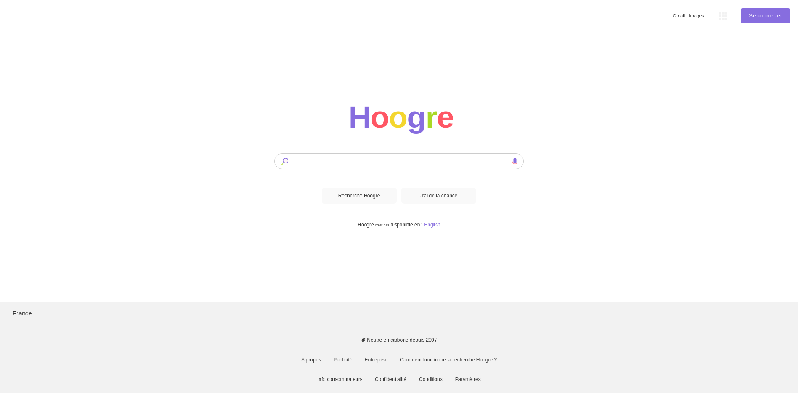

# Google Homepage

   

### Aperçu

Recréation de la page d'accueil de [Google](https://www.google.com) en HTML, CSS et un peu de JS pendant la journée 2 de THP.

La recherche est fonctionnelle (lorsqu'on entre du texte dans la barre de recherche et qu'on appuie sur un des 2 boutons ou sur Entrée, la recherche est effectuée sur Google).

Tous les liens sont cliquables et peuvent contenir des petits easter eggs ;)

Bonne correction !

### Screenshot et Live Site

[Accéder au site web](https://infallible-fermi-db5377.netlify.app/)

